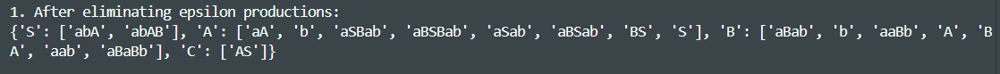
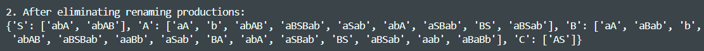
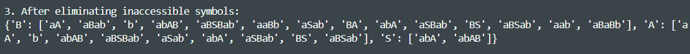
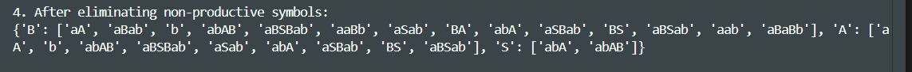
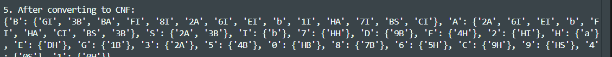

# Chomsky Normal Form

### Course: Formal Languages & Finite Automata

### Author: Vladimir Vitcovschii

## Theory

One fundamental concept in the area of formal languages and finite automata is the Chomsky Normal Form (CNF), named after the linguist Noam Chomsky. CNF is a way of simplifying grammars to a standardized form, where every production rule fits a specific pattern. A grammar is said to be in CNF if all its production rules are of the form `A → BC` or `A → a`, where `A`, `B`, and `C` are non-terminal symbols, and `a` is a terminal symbol. The simplification to CNF is crucial as it allows for the implementation of efficient parsing algorithms.

The process of transforming an arbitrary context-free grammar into Chomsky Normal Form involves several systematic steps, each aimed at reducing the complexity of the grammar while preserving the language it generates. The typical steps include eliminating null productions (productions that generate the empty string), removing unit productions (productions where a non-terminal is mapped directly to another non-terminal), removing non-productive symbols (symbols that cannot be reached from the start symbol), and removing non-reachable symbols (symbols that cannot generate any terminal string). Lastly, we have to ensure that all remaining productions meet the CNF criteria. This normalization process is not merely a mechanical transformation but requires a deep understanding of the underlying structure of the grammar and the language it defines.

## Objectives

1. Learn about Chomsky Normal Form (CNF).
2. Get familiar with the approaches of normalizing a grammar.
3. Implement a method for normalizing an input grammar by the rules of CNF.
   1. The implementation needs to be encapsulated in a method with an appropriate signature (also ideally in an appropriate class/type).
   2. The implemented functionality needs executed and tested.
   3. A **BONUS point** will be given for the student who will have unit tests that validate the functionality of the project.
   4. Also, another **BONUS point** would be given if the student will make the aforementioned function to accept any grammar, not only the one from the student's variant.

## Implementation description

### Grammar Class

The provided Python code in file `Grammar3.py` defines a class Grammar that encapsulates a context-free grammar and includes methods for transforming it into Chomsky Normal Form. The transformation process involves several steps, each targeting a specific type of production rule that does not conform to CNF.

The empty symbol is recognized as the empty symbol in the same file `Grammar3.py`.

The `Grammar3` class is defined to encapsulate the components of a context-free grammar: non-terminals, terminals, production rules, and a start symbol. This encapsulation facilitates the operations and transformations required on the grammar, such as converting it to CNF.

The transitions can then be printed via the simple call of print(grammar).

### Eliminating Epsilon Productions

The `eliminateEpsilonProductions` method in the `Grammar3` class identifies and removes epsilon (ε) productions—rules that produce an empty string—while ensuring that the language of the grammar is preserved.

The method begins by identifying all nullable non-terminals, which are non-terminals that can directly or indirectly produce an empty string. It initializes a set nullable to keep track of such non-terminals. For each non-terminal, the method iterates through its production rules. If any production is equal to `EPSILON`, the non-terminal is added to the set.

```python
nullable = set()
for nonTerminal in self.Vn:
    for production in self.P[nonTerminal]:
        if production == EPSILON:
            nullable.add(nonTerminal)
```

Next, the method accounts for indirectly nullable non-terminals that can produce ε through a series of productions involving other nullable non-terminals. It does this through an iterative process that repeatedly scans the grammar's non-terminals until no new nullable non-terminals are found. If such a non-terminal pis found, it too is considered nullable.

```python
changes = True
while changes:
    changes = False
    for nonTerminal in self.Vn:
        if nonTerminal not in nullable:
            for production in self.P[nonTerminal]:
                if all(symbol in nullable for symbol in production):
                    nullable.add(nonTerminal)
                    changes = True
                    break
```

With all nullable non-terminals identified, the method proceeds to eliminate ε-productions. For each production rule that is not ε, it expands the rule by considering nullable symbols, effectively generating new productions that omit some or all of the nullable symbols. This expansion is handled by the `_expandNullableProd` helper method. The resulting productions replace the original productions in the grammar.

```python
newRules = {}
for nonTerminal in self.P:
    newProds = []
    for production in self.P[nonTerminal]:
        if production != EPSILON:
            newProds.extend(self._expandNullableProd(production, nullable))
    newRules[nonTerminal] = list(set(newProds))
```

The `_expandNullableProd` method generates all possible expansions of a given production by selectively including or excluding nullable non-terminals. It iterates through each symbol in the production: if the symbol is nullable, it generates new expansions with and without the symbol; if the symbol is not nullable, it simply appends it to each current expansion.

```python
def _expandNullableProd(self, production, nullable):
    expansions = ['']

    for symbol in production:
        newExpansions = []
        if symbol in nullable:
            for expansion in expansions:
                newExpansions.append(expansion + symbol)
                newExpansions.append(expansion)
        else:
            for expansion in expansions:
                newExpansions.append(expansion + symbol)
        expansions = newExpansions

    return [expansion for expansion in expansions if expansion]
```



### Eliminating Renaming Productions

The eliminate_renaming method is designed to remove renaming (or unit) productions from the grammar. A unit production is a production rule of the form `A → B`, where both `A` and `B` are non-terminal symbols.

The process begins with a loop that continues as long as changes are being made to the grammar, ensuring that all unit productions are addressed. The variable `changes` acts as a flag to track whether any unit productions were eliminated in a given iteration, prompting another pass if necessary.

```python
changes = True
while changes:
    changes = False
    for nonTerminal in self.Vn:
        ...
```

For each non-terminal, the method identifies unit productions—productions where the right-hand side is a single non-terminal. Each unit production for a non-terminal `A` that produces `B` is replaced by the productions of `B`. This is done by appending `B`'s productions to `A`'s production list, then removing the original unit production. Duplicates are removed to maintain the set-like nature of production lists.

```python
unitProductions = [p for p in self.P[nonTerminal] if p in self.Vn]
for unit in unitProductions:
    newProductions = self.P[unit]
    if newProductions:
        self.P[nonTerminal].extend(newProductions)
        self.P[nonTerminal].remove(unit)
        self.P[nonTerminal] = list(set(self.P[nonTerminal]))
        changes = True
self.P[nonTerminal] = [
    p for p in self.P[nonTerminal] if p not in self.Vn
]
```

After processing all unit productions for a given non-terminal, a final pass is made to ensure that no unit productions remain. This is done by filtering the production list of each non-terminal, retaining only those productions that do not consist solely of another non-terminal.

```python
self.P[nonTerminal] = [p for p in self.P[nonRerminal] if p not in self.Vn]
```



### Eliminating Inaccessible Symbols

The `eliminateInaccessibleSymbols` method is focused on identifying and removing symbols in a grammar that cannot be reached from the start symbol through any series of production rules. Inaccessible symbols, which may include both non-terminal and terminal symbols, do not contribute to the language generated by the grammar and can therefore be safely removed for simplification.

The method begins by initializing a set named `accessible` with the start symbol of the grammar. This set will be expanded to include all symbols that can be reached from the start symbol. The core of the method is an iterative process that expands this set by examining the productions of the currently accessible non-terminals. If a production contains a non-terminal symbol that is not yet marked as accessible, it is added to the set, and the changes flag is set to `True`, indicating that another iteration is necessary to ensure all accessible symbols are discovered. This process repeats until no new accessible symbols are found in an iteration.

```python
accessible = {self.S}
changes = True
oldRules = self.P.copy()

while changes:
    changes = False
    for nonTerminal in accessible.copy():
        for production in self.P[nonTerminal]:
            for symbol in production:
                if symbol in self.Vn and symbol not in accessible:
                    accessible.add(symbol)
                    changes = True


```

Once all accessible symbols have been identified, the grammar is updated to reflect this. The list of non-terminals is replaced with the list of accessible symbols. The production rules are then filtered to retain only those corresponding to the accessible non-terminals, using the `oldRules` copy of the original rules to ensure that the filtering process does not overlook any rules due to changes made during the iteration.

```python
self.Vn = list(accessible)
self.P = {nt: oldRules[nt] for nt in accessible}
```



### Eliminating Non-Productive Symbols

The `eliminateNonProductiveSymbols` method is designed to remove non-productive symbols from a grammar. A symbol is considered non-productive if it cannot be used in any derivation of a terminal string.

The method begins by initializing a set named `productive` with the start symbol, which is inherently productive since it is the entry point of any derivation. It then iterates over all non-terminals, checking if they can produce a terminal string either directly or through a series of productions involving other productive symbols. If a non-terminal is found to be productive, it is added to the productive set, and the method continues to iterate until no new productive symbols are discovered, indicated by the changes flag remaining `False`.

```python
def eliminateNonProductiveSymbols(self):
        productive = {self.S}
        changes = True

        while changes:
            changes = False
            for nonTerminal in self.Vn:
                if nonTerminal not in productive:
                    for production in self.P[nonTerminal]:
                        if all(symbol in self.Vt or symbol in productive for symbol in production):
                            productive.add(nonTerminal)
                            changes = True
                            break
```

After identifying all productive symbols, the method proceeds to update the grammar. The list of non-terminals is replaced with the set of productive symbols, effectively removing non-productive non-terminals. The production rules are then filtered to retain only those that involve productive symbols, ensuring that every production in the updated grammar can lead to a terminal string. This filtering process results in a new set of rules (`updatedRules`), which replaces the original rules of the grammar.

```python
def eliminateNonProductiveSymbols(self):
        self.Vn = list(productive)
        updatedRules = {}
        for nt in productive:
            productiveRules = []
            for production in self.P[nt]:
                if all(symbol in self.Vt or symbol in productive for symbol in production):
                    productiveRules.append(production)
            updatedRules[nt] = productiveRules

        self.P = updatedRules
```



### Converting to Chomsky Normal Form

The `is_cnf` method serves a diagnostic purpose within the Grammar class, allowing for a quick check to see if the grammar adheres to Chomsky Normal Form (CNF). This method iterates through each production rule of the grammar and applies a series of checks to determine if the rule conforms to the restrictions of CNF. The checks include verifying that each production rule is either of the form `A → BC` or `A → a`, where `A`, `B`, and `C` are non-terminal symbols, and `a` is a terminal symbol. If any rule violates these conditions, the method returns `False`, indicating that the grammar is not in CNF. If all rules pass the checks, the method returns `True`, indicating that the grammar is in CNF.

```python
def isCnf(self):
        for nonTerminal in self.P:
            for production in self.P[nonTerminal]:
                if len(production) == 0 or len(production) > 2:
                    return False
                if len(production) == 1 and production not in self.Vt:
                    return False
                if len(production) == 2 and any(symbol in self.Vt for symbol in production):
                    return False
        return True
```



This method is used in the `toCnf` method, which is responsible for transforming the grammar into Chomsky Normal Form. The method first checks if the grammar is already in CNF using the `isCnf` method. If the grammar is not in CNF, the method proceeds with the normalization process: it eliminates epsilon productions, then removes unit productions, followed by eliminating non-productive and inaccessible symbols. After these preparatory steps, the method proceeds to convert the grammar to CNF by enforcing the specific structure required by CNF.

```python
if self.isCnf():
    return

self.eliminateEpsilonProductions()
if printSteps:
    print('1. After eliminating epsilon productions:')
    print(self)
    print()

self.eliminateRenaming()
if printSteps:
    print('2. After eliminating renaming productions:')
    print(self)
    print()

self.eliminateInaccessibleSymbols()
if printSteps:
    print('3. After eliminating inaccessible symbols:')
    print(self)
    print()

self.eliminateNonProductiveSymbols()
if printSteps:
    print('4. After eliminating non-productive symbols:')
    print(self)
    print()
```

The core transformation begins by iterating through each production rule of every non-terminal in the grammar. For each production, if it contains more than two symbols, the method takes the first two symbols and checks if a new non-terminal has already been introduced for this specific combination. If so, it uses the existing non-terminal; otherwise, it generates a new non-terminal symbol using the `_createNewNonTerminal` method. This new non-terminal, representing the initial two symbols, is then prepended to the remainder of the production, effectively reducing its length by one symbol. This process repeats in a loop until the production conforms to CNF, either by being reduced to a single terminal or two non-terminals.

```python
rhsToNonTerminal = {}
oldNonTerminals = list(self.P)

newRules = {}
for nonTerminal in list(self.P):
    newRules[nonTerminal] = set()
for production in self.P[nonTerminal]:
    while len(production) > 2:
        firstTwoSymbols = production[:2]

        if firstTwoSymbols in rhsToNonTerminal:
            newNonTerminal = rhsToNonTerminal[firstTwoSymbols]
        else:
            newNonTerminal = self._createNewNonTerminal()
            newRules[newNonTerminal] = {firstTwoSymbols}
            rhsToNonTerminal[firstTwoSymbols] = newNonTerminal

        production = newNonTerminal + production[2:]

    newRules[nonTerminal].add(production)
```

After addressing the productions that are too long, the method then turns to "mixed productions" — consisting of two symbols where at least one is a terminal. For each such production, the method iterates through its symbols. If a symbol is a terminal, the method checks whether a new non-terminal has already been designated for this terminal. If not, a new non-terminal is created, and a rule is added for this non-terminal to produce the terminal symbol. The original production is then replaced with a new production that uses the non-terminal in place of the terminal symbol, ensuring the production is CNF-compliant.

```python
for nonTerminal, productions in list(newRules.items()):
            tempProductions = productions.copy()
            for production in tempProductions:
                if len(production) == 2 and any(symbol in self.Vt for symbol in production):
                    newProduction = []
                    for symbol in production:
                        if symbol in self.Vt:
                            if symbol in rhsToNonTerminal:
                                newNonTerminal = rhsToNonTerminal[symbol]
                            else:
                                newNonTerminal = self._createNewNonTerminal()
                                newRules[newNonTerminal] = {symbol}
                                rhsToNonTerminal[symbol] = newNonTerminal
                            newProduction.append(newNonTerminal)
                        else:
                            newProduction.append(symbol)
                    productions.remove(production)
                    productions.add(''.join(newProduction))
```

Following the transformation of all non-compliant productions, the method reconstructs the set of grammar rules. It ensures that the new rules include both the original non-terminals and any new non-terminals introduced during the transformation, maintaining the original order as much as possible. This reordering is crucial for preserving the hierarchical structure and readability of the grammar.

```python
self.P = {nt: newRules[nt] for nt in oldNonTerminals +
                      list(set(newRules) - set(oldNonTerminals))}

        if printSteps:
            print('5. After converting to CNF:')
            print(self)
```

Coming back to the the `_createNewNonTerminal` method, it designed to generate unique non-terminal symbols during the process of converting a grammar to CNF. The method starts with a predefined `alphabet` comprising digits, uppercase Latin letters. This diverse set ensures a wide range of potential symbols for new non-terminals, reducing the likelihood of exhausting available symbols even in complex grammars.

Initially, the method attempts to find an unused symbol within the Latin alphabet portion of the alphabet string. It iterates through each character in the alphabet, checking whether it is already present in the `Vn` set of the grammar. If it finds an unused symbol, it adds this symbol to the `Vn` set and returns it for immediate use in the grammar transformation process.

```python
def _createNewNonTerminal(self):
    alphabet = '0123456789ABCDEFGHIJKLMNOPQRSTUVWXYZαβγδζηθικλμνξοπρστυφχψω'

    for letter in alphabet:
        if letter not in self.Vn:
            self.Vn.append(letter)
            return letter

    for letter in alphabet:
        for num in range(50):
            newSymbol = f'{letter}{num}'
            if newSymbol not in self.Vn:
                self.Vn.append(newSymbol)
                return newSymbol

    raise ValueError("Exhausted all possible non-terminal symbols.")
```

### Unit tests

The `testGrammar.py` file contains a suite of unit tests designed to verify the correctness and reliability of the Grammar class's functionality to transform an arbitrary context-free grammar into CNF. These tests are implemented using Python's `unittest` framework. As setup, the tests create instances of the Grammar class with the grammar from variant 32 (my assigned variant). Through a series of targeted unit tests, it methodically verifies that each step of the transformation process aligns with the theoretical requirements of CNF and that the final transformed grammar is indeed in the correct form. The tests cover the elimination of epsilon productions, renaming productions, inaccessible symbols, and non-productive symbols, as well as the conversion to CNF.


## Conclusions

This project demonstrates a complete and methodical approach to converting any context-free grammar into Chomsky Normal Form (CNF) using Python. By encapsulating the grammar and its transformations in a dedicated `Grammar3` class, the implementation achieves modularity, clarity, and reusability. The step-by-step normalization process—eliminating ε-productions, renaming/unit productions, inaccessible symbols, and non-productive symbols—ensures that the final grammar strictly adheres to CNF rules. Moreover, the solution is generic and can be applied to any context-free grammar, not just a fixed input, fulfilling both the core and bonus requirements of the project.

This work not only deepens understanding of formal grammar transformation but also emphasizes practical algorithm design, object-oriented programming, and code testing in Python. The visual outputs and helper methods like `isCnf()` and `toCnf()` offer a clear, inspectable path from raw grammar to normalized form, making the codebase both educational and practical for further extensions or integration into parsers.