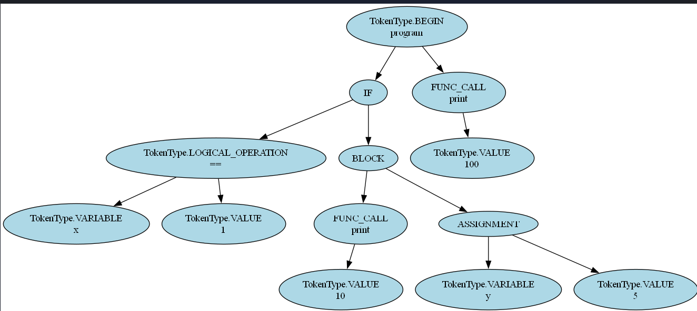

# Abstract Syntax Tree Parsing

### Course: Formal Languages & Finite Automata  
### Author: Vladimir Vitocvschii  

----  

## Theory  
An abstract syntax tree (AST) is a data structure used in computer science to represent the structure of a program or code snippet. It is a tree representation of the abstract syntactic structure of text (often source code) written in a formal language. Each node of the tree denotes a construct occurring in the text.  
The syntax is "abstract" in that it omits certain details (e.g., parentheses for grouping) and focuses on structural or content-related elements. ASTs are crucial in compilers, program analysis, and transformation systems, serving as an intermediate representation during compilation.  

## Objectives:  
1. Get familiar with parsing, its concepts, and implementation.  
2. Understand the role of ASTs in representing code structure.  
3. Extend the 3rd lab work with the following:  
   1. Define a `TokenType` enum to categorize tokens using regex.  
   2. Implement AST data structures suitable for the parsed text.  
   3. Develop a parser to extract syntactic information from input.  

---

## Implementation Description  

### `TokenType` Class  
The `TokenType` enumeration defines token categories for a programming language, including control structures, operations, variables, and literals. Additional enums (`BuiltInFunction`, `ArithmeticOperation`, `LogicalOperation`) specify subtypes for functions and operations.  
```python  
from enum import Enum  

class TokenType(Enum):  
    BEGIN = 1  
    END = 2  
    LOGICAL_OPERATION = 3  
    ARITHMETIC_OPERATION = 4  
    VARIABLE = 5  
    END_LINE = 6  
    FUNCTION = 7  
    DEFINITION = 8  
    BUILT_IN_FUNCTIONS = 9  
    VALUE = 10  
    BRACKETS = 11  
    UNKNOWN = 12  
    IF = 13  

class BuiltInFunction(Enum):  
    PRINT = 1  
    SIN = 2  
    COS = 3  

class ArithmeticOperation(Enum):  
    ASSIGN = 1  
    PLUS = 2  
    MINUS = 3  
    DIVISION = 4  
    MULTIPLICATION = 5  

class LogicalOperation(Enum):  
    NOT = 1  
    OR = 2  
    AND = 3  
    EQUALS = 4  
    MORE = 5  
    LESS = 6  
    LESS_EQ = 7  
    MORE_EQ = 8  
    NOT_EQ = 9

```      
### Lexer (Tokeniser)
The Tokeniser class tokenizes input text using regex patterns. It identifies keywords, variables, literals, brackets, and operations. A tokenMap maps reserved keywords (e.g., begin, if, print) and symbols to their respective TokenType.

```python
class Tokeniser:  
    def __init__(self, tokenMap: dict[str, TokenType]):  
        self.tokenMap = tokenMap  

    def tokenize(self, text: str):  
        tokens = []  
        i = 0  
        while i < len(text):  
            if text[i].isspace():  
                i += 1  
                continue  
            # Regex patterns for tokens (simplified for brevity)  
            token_patterns = [  
                (r'(!=|<=|>=|&&|==|\|\|)', TokenType.LOGICAL_OPERATION),  
                (r'[\+\-\*/=]', TokenType.ARITHMETIC_OPERATION),  
                (r'[0-9]+(\.[0-9]+)?', TokenType.VALUE),  
                (r'"[^"]*"', TokenType.VALUE),  
                (r'[a-zA-Z_][a-zA-Z0-9_]*', TokenType.VARIABLE),  
                (r'[(){};]', TokenType.BRACKETS),  
            ]  
            # Matching logic...  
        return tokens
```          
### Abstract Syntax Tree Node Class
The ASTNode class represents nodes in the AST. Each node has a type (e.g., IF, ASSIGNMENT), a value (e.g., variable name, literal), and children nodes.

```python
class ASTNode:  
    def __init__(self, type, children=None, value=None):  
        self.type = type  
        self.value = value  
        self.children = children if children is not None else []  

    def __repr__(self):  
        type_name = self.type.name if isinstance(self.type, TokenType) else self.type  
        return f"{type_name}({self.value}, {self.children})"  
```

## Parser Class
The Parser class constructs the AST by processing tokens. It handles statements like if conditions, assignments, function calls, and expressions.

```python
class Parser:  
    def __init__(self):  
        self.tokens = []  
        self.pos = 0  

    def parse(self, tokens):  
        self.tokens = tokens  
        self.pos = 0  
        self.expect(TokenType.BEGIN)  
        program_node = ASTNode(TokenType.BEGIN, value="program")  

        while not self.check(TokenType.END):  
            stmt = self.parse_statement()  
            program_node.children.append(stmt)  

        self.expect(TokenType.END)  
        return program_node  

    def parse_statement(self):  
        if self.check(TokenType.IF):  
            return self.parse_if()  
        elif self.check(TokenType.BUILT_IN_FUNCTIONS):  
            stmt = self.parse_function_call()  
        elif self.check(TokenType.VARIABLE):  
            stmt = self.parse_assignment()  
        # Additional parsing methods for expressions, blocks, etc.
```   
## Execution and Result
Sample Input:

```python
tokens = tokeniser.tokenize("""  
  begin  
    if (x == 1) {  
      print(10);  
      y = 5;  
    }  
    print(100);  
  end  
""")
```  
## Generated AST:
```
BEGIN(program, [  
    IF([  
        LOGICAL_OPERATION(==, [VARIABLE(x), VALUE(1)]),  
        BLOCK([  
            FUNC_CALL(10, [VALUE(10)]),  
            ASSIGNMENT([VARIABLE(y), VALUE(5)])  
        ]),  
    FUNC_CALL(100, [VALUE(100)])  
])  
```
## Visualization:


## Conclusion:

This laboratory work demonstrated the construction of an AST for a custom programming language. The Tokeniser class leveraged regex to categorize tokens, while the Parser class methodically built the AST by handling control structures (if), assignments, function calls, and expressions. The AST effectively captured the hierarchical relationships between statements, validated by the sample input's output. This implementation underscores the importance of parsing techniques and ASTs in formal language processing, providing a foundation for further exploration in compiler design and program analysis.