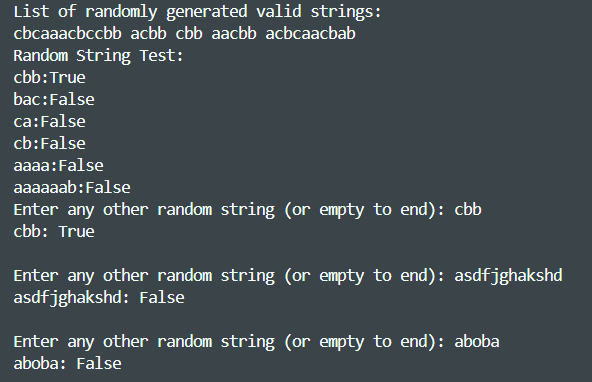

# Topic: Intro to formal languages. Regular grammars. Finite Automata.

### Course: Formal Languages & Finite Automata
### Author: Vladimir Vitcovshcii

----
## Objectives:
  1. Understand concept of Finite Automaton
  2. Implement the Finite Automaton with custom set Grammar
  3. Setup the repo for the future use 
```
  My variant was 31:
  {
    VN = {S, D, R},
    VT = {a, b, c},
    P = {
        S → aS     
        S → bS    
        S → cD   
        D → bD    
        D → cR  
        D → a
        R → b
    }
  }  
```
## Implementation description
I chose the python language to skip all the distracting implementations even though I am really upset
that python does not have object spreadinig like javascript, I even, at some moment, imported a library that implements the js object(dict) spreading, but nevertheless it is what it is.

The implementation itself goes after the given example the only difference between the given "assist" and my implementation is separation of the classes. The grammar class takes the elements to initialize the language grammar. After that the grammar elements are used in Finite automaton creation which than is able to validate the input if it belongs to the given grammar. The last, but least is the main, just initialization and invoke, nothing more nothing less.

This is the structure of the Program    
```python
class Grammar:
  def __init__(**args):
# Initializtion
  def generateValidString():
# Generates some valid strings for grammar
  def toFiniteAutomata():
# Procesess grammar to make transitions which will be given to finite automaton and returns the instance of it    
    return FiniteAutomata( )

class FiniteAutomata:
  def __init__(**args):
# Initializes the automaton
  def stringValidation(inp):
# Validates the given input
```

The output:



## Conclusions
In this work, I explored the fundamentals of formal languages, regular grammars, and finite automata. The main objective was to understand finite automata, implement a custom one based on a given grammar, and set up a structured repository for future use.

The result was a functional finite automaton capable of validating strings according to the specified grammar. The structured approach ensures scalability and future modifications. This work provided valuable insights into automata theory and practical implementation, reinforcing the theoretical knowledge gained from lectures.

## References
1. Lecture notes