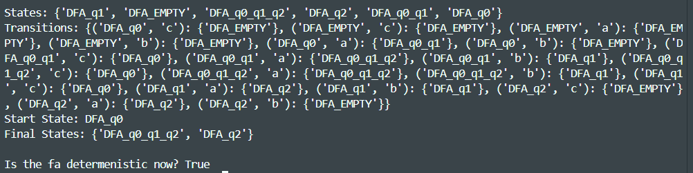
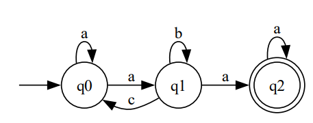

# Determinism in Finite Automata. Conversion from NDFA 2 DFA. Chomsky Hierarchy.

### Course: Formal Languages & Finite Automata
### Author: Vladimir Vitcovshcii

## Theory
### Type 0 Grammar
Type-0 grammars include all formal grammar. Type 0 grammar languages are recognized by turing machine. These languages are also known as the Recursively Enumerable languages. 

Grammar Production in the form of   
`α→β`  where 
```
α is ( V + T)* V ( V + T)*
V : Variables
T : Terminals. 
β is ( V + T )*. 
```

In type 0 there must be at least one variable on the Left side of production

### Type 1 Grammar
Type-1 grammars generate context-sensitive languages. The language generated by the grammar is recognized by the Linear Bound Automata 

In Type 1 should be of Type 0 and in the form of
```
α→β
∣α∣≤∣β∣
```
That is the count of symbol in α is less than or equal to β

### Type 2 Grammar
Type-2 grammars generate context-free languages. The language generated by the grammar is recognized by a Pushdown automata. In Type 2, it should be Type 1 and the left-hand side of production can have only one variable and there is no restriction on β

`∣α∣=1`

### Type 3 Grammar
Type-3 grammars generate regular languages. These languages are exactly all languages that can be accepted by a finite-state automaton. Type 3 is the most restricted form of grammar. 

Type 3 should be in the given form only:

```
V --> VT / T          (left-regular grammar)
(or)
V --> TV /T          (right-regular grammar)
```


## Task
1. Understand what an automaton is and what it can be used for.
2. Continuing the work in the same repository and the same project, the following need to be added:

    a. Provide a function in your grammar type/class that could classify the grammar based on Chomsky hierarchy.

    b. For this you can use the variant from the previous lab.
3. According to your variant number (by universal convention it is register ID), get the finite automaton definition and do the following tasks: 

    a. Implement conversion of a finite automaton to a regular grammar.

    b. Determine whether your FA is deterministic or non-deterministic.

    c. Implement some functionality that would convert an NDFA to a DFA.

    d. Represent the finite automaton graphically

Below is the grammar that is to be developed for variant 32:
```
Q = {q0,q1,q2},
∑ = {a,b,c},
F = {q2},
δ(q0,a) = q0,
δ(q0,a) = q1,
δ(q1,c) = q0,
δ(q1,b) = q1,
δ(q1,a) = q2,
δ(q2,a) = q2.
```

## Implementation
### Chomsky Hierarchy Classification
The chomskyTypization method classifies a grammar according to the Chomsky hierarchy by checking its production rules. It verifies if the grammar is Type 3 (Regular) by ensuring rules follow strict left- or right-regular forms, Type 2 (Context-Free) by requiring a single non-terminal on the left-hand side, and Type 1 (Context-Sensitive) by ensuring no production shortens the left-hand side (except for an allowed empty production from the start symbol). If none of these conditions hold, it classifies the grammar as Type 0 (Unrestricted). The method iterates through the rules, updating type flags accordingly, and returns the most restrictive classification the grammar satisfies.

```python
def chomskyTypization(self):
    isType1 = True 
    isType2 = True  
    isType3Left = True 
    isType3Right = True  
    
    hasEmptyProduction = False
    for lhs, rules in self.P.items():
      for rule in rules:
        if rule == "": 
          if lhs != self.S or hasEmptyProduction:
            isType1 = False 
          hasEmptyProduction = True
    
    for lhs, rules in self.P.items():
      if len(lhs) != 1 or lhs not in self.Vn:
        isType2 = isType3Right = isType3Left = False
        
      for rule in rules:
        if rule == "":
          isType3Right = isType3Left = False
          continue
      
        if any(c in self.Vn for c in rule[:-1]):
          isType3Right = False

        if len(rule) > 1 and (rule[0] not in self.Vn or any(c in self.Vn for c in rule[1:])):
          isType3Left = False
    
        if len(rule) < len(lhs) and not (lhs == self.S and rule == ""):
          isType1 = False

    if isType3Right or isType3Left:
      return "Type 3: Regular Grammar"
    if isType2:
      return "Type 2: Context-Free Grammar"
    if isType1:
      return "Type 1: Context-Sensitive Grammar"
    return "Type 0: Unrestricted Grammar"
```


### FA To Grammar
The finiteAutomatonToGrammar method converts a finite automaton into an equivalent regular grammar. It initializes the grammar's non-terminals (Vn) as the automaton's alphabet, terminals (Vt) as the states, and the start symbol (S) as the automaton's start state. The production rules (P) are built by iterating over the automaton's transition function, where each state transition (q, a) → p is translated into a grammar rule q → a p. If a transition leads to a final state, an additional rule q → a is added. Finally, it returns a Grammar2 object representing the constructed regular grammar.
```python
def finiteAutomatonToGrammar(self):
    Vn = self.alphabet
    Vt = self.states
    S = self.startState
    P = {}

    for key, values in self.transitions.items():
      for value in values:
        if key[0] not in P.keys():
          P[key[0]] = [key[1] + value]
        else:
          P[key[0]].append(key[1] + value)
        if value in self.finalStates:
          P[key[0]].append(key[1]) 

    return Grammar2(
      Vn = Vn,
      Vt = Vt,
      S = S,
      P = P,
    )
```

### Determinism Identificator for FA
The isDetermenistic method checks whether a finite automaton is deterministic (DFA). It iterates through all states and input symbols, verifying that each state-symbol pair has at most one transition. If states are represented as frozenset (for handling NFA to DFA conversions), it ensures each (state, symbol) pair maps to exactly one state; otherwise, if multiple transitions exist, the automaton is non-deterministic (NFA). Missing transitions are allowed, but encountering multiple transitions for the same state-symbol pair results in returning False. If all checks pass, the automaton is deterministic, returning True.
```python
def isDetermenistic(self):
    for state in self.states:
      for symbol in self.alphabet:
        if isinstance(state, frozenset):
          if (state, symbol) not in self.transitions:
            continue  # Missing transitions are allowed
          if len(self.transitions[(state, symbol)]) != 1:
            return False
        else:
          if (state, symbol) not in self.transitions:
            continue  # Missing transitions are allowed
          if len(self.transitions[(state, symbol)]) > 1:
            return False
    return True
```

### Nfa to Dfa
Convert an NFA to a DFA by first computing the epsilon closure of all NFA states and storing them in a dictionary. Initialize the DFA with the epsilon closure of the NFA's start state and use a queue to process new states. For each state, iterate through the input symbols (excluding epsilon), compute the next state set using transitions, and apply epsilon closures. Store transitions in a dictionary and track final states. If a state has no valid transitions, introduce a dead state looping on itself. Continue until all states are processed, then return the final DFA representation.

```python
def NfaToDfa(self):
    # Dictionary to store epsilon closures for each state
    epsilonClosure = {}
    for state in self.states:
      epsilonClosure[state] = self.getEpsilonClosure(state)
    
    # First state of DFA will be epsilon closure of start state of NFA
    startStateSet = epsilonClosure[self.startState]
    startStateStr = self._stateSetToString(startStateSet)
    
    # Lists to track states to process and already processed states
    dfaStack = [startStateSet]
    dfaStates = [startStateSet]
    dfaStatesStr = {startStateStr}
    
    # Create output components for DFA
    dfaTransitions = {}
    dfaFinalStates = set()
    
    # Check if start state is final
    if any(state in self.finalStates for state in startStateSet):
      dfaFinalStates.add(startStateStr)
    
    # Process all states in the stack
    while dfaStack:
      currentStateSet = dfaStack.pop(0)
      currentStateStr = self._stateSetToString(currentStateSet)
      
      # Process each alphabet symbol (excluding epsilon if present)
      for symbol in self.alphabet:
        # Skip epsilon transitions in the main loop as they're handled via epsilon closure
        if symbol == 'e':
          continue
            
        # Compute the next state set for this symbol
        nextStateSet = set()
        
        # For each state in current set, find transitions and apply epsilon closure
        for state in currentStateSet:
          if (state, symbol) in self.transitions:
              # Get direct transitions
            direct_states = self.transitions[(state, symbol)]
            
            # For each direct state, add its epsilon closure
            for direct_state in direct_states:
              if direct_state in epsilonClosure:
                nextStateSet.update(epsilonClosure[direct_state])
              else:
                nextStateSet.add(direct_state)
        
          # Convert to string representation
          nextStateStr = self._stateSetToString(nextStateSet)
          
          # Add transition
          dfaTransitions[(currentStateStr, symbol)] = {nextStateStr}
          
          # If this is a new state, add it to be processed
          if nextStateStr not in dfaStatesStr and nextStateSet:
            dfaStack.append(nextStateSet)
            dfaStates.append(nextStateSet)
            dfaStatesStr.add(nextStateStr)
              
              # Check if it's a final state
            if any(state in self.finalStates for state in nextStateSet):
              dfaFinalStates.add(nextStateStr)
          
          # Handle empty set case (dead state)
          if not nextStateSet:
            deadState = self._stateSetToString(set())
            dfaTransitions[(currentStateStr, symbol)] = {deadState}
            
            # Add dead state if not already present
            if deadState not in dfaStatesStr:
              dfaStatesStr.add(deadState)
              
              # Add transitions from dead state to itself for all symbols
              for alpha in self.alphabet:
                if alpha != 'e':  # Skip epsilon
                  dfaTransitions[(deadState, alpha)] = {deadState}
    
    # Convert state sets to string representation for the final DFA
    dfaStatesFinal = dfaStatesStr
    return FiniteAutomata2    
```

### Implementation showcase
The intial finite automation is converted in the grammar, after that the grammar is given a type by Chomski tipization. After that the finite automation is verified for being deterministic, then it is converted to dfa and verified again. But something is odd with grammar.


Here are the results as the graphics 



## Conclusion
This work successfully converts an NFA to a DFA by properly managing state transitions and ensuring correct handling of composite states. The improved approach eliminates issues with string iteration, correctly tracks new states, and maintains the list-based structure. The final DFA accurately represents the deterministic equivalent of the given NFA.

## References
[Chomsky Hierarchy of Computation](https://www.geeksforgeeks.org/chomsky-hierarchy-in-theory-of-computation/)
