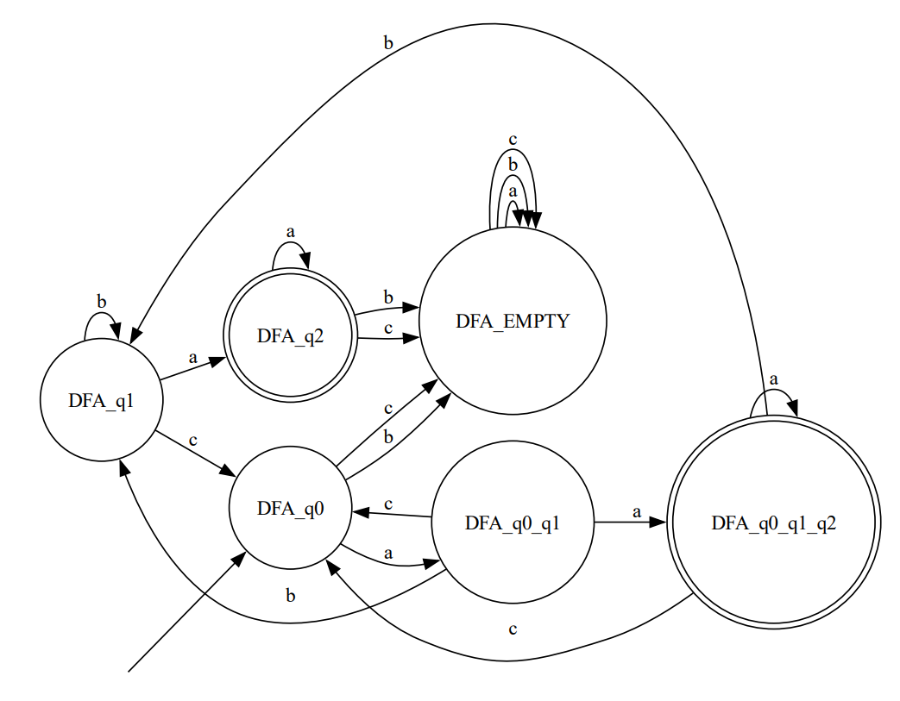

# Topic: Intro to formal languages. Regular grammars. Finite Automata.

### Course: Formal Languages & Finite Automata
### Author: Vladimir Vitcovshcii

----
## Objectives:
  1. Understand concept of Finite Automaton
  2. Implement the Finite Automaton with custom set Grammar
  3. Setup the repo for the future use 
```
  My variant was 32:
  {
    Variant 32:
      Q = {q0,q1,q2},
      ∑ = {a,b,c},
      F = {q2},
      δ(q0,a) = q0,
      δ(q0,a) = q1,
      δ(q1,c) = q0,
      δ(q1,b) = q1,
      δ(q1,a) = q2,
      δ(q2,a) = q2.
  }  
```
## Theory

### Finite Automata
Finite automata are abstract machines used to recognize patterns in input sequences, forming the basis for understanding regular languages in computer science. They consist of states, transitions, and input symbols, processing each symbol step-by-step. If the machine ends in an accepting state after processing the input, it is accepted; otherwise, it is rejected. Finite automata come in deterministic (DFA) and non-deterministic (NFA), both of which can recognize the same set of regular languages. They are widely used in text processing, compilers, and network protocols.

### Finite Languages

A finite language is a subset of strings over an alphabet that contains a limited number of elements. Unlike infinite languages (e.g., those defined by regular expressions or grammars that allow recursion), finite languages are strictly bounded in the number of words they can generate. These languages can always be recognized by a finite automaton since their state space is limited.

For example, a finite language over the alphabet {a, b, c} might be:L = { "a", "ab", "abc", "bca" }

Since the language contains a fixed number of elements, it can be easily modeled using a simple finite automaton with a defined set of accepting states corresponding to each word in the language.

Finite languages are useful in applications like keyword recognition, predefined command sets, and pattern matching, where the number of valid strings is strictly known.

## Implementation description
I chose the python language to skip all the distracting implementations even though I am really upset
that python does not have object spreadinig like javascript, I even, at some moment, imported a library that implements the js object(dict) spreading, but nevertheless it is what it is.

The implementation itself goes after the given example the only difference between the given "assist" and my implementation is separation of the classes. The grammar class takes the elements to initialize the language grammar. After that the grammar elements are used in Finite automaton creation which than is able to validate the input if it belongs to the given grammar. The last, but least is the main, just initialization and invoke, nothing more nothing less.

This is the structure of the Program:

```python
class Grammar:
  ...
  def toFiniteAutomata():
    for nonTerm, res in self.P.items():
      for sequence in res:
      
        statePos = next((i for i, c in enumerate(sequence) if c in states), -1) # should be also updated to more non-terminals
        
        
        key = (
          nonTerm, 
          sequence[:statePos] if statePos != -1 else sequence
        )

        value = sequence[statePos] if statePos != -1 else ""

        if key not in transitionFunction:
          transitionFunction[key] = [value]
        elif value not in transitionFunction[key]:  
          transitionFunction[key].append(value)
  ...
```
In the first loop the cycle goes through all the rules/conditions for non terminals and values they can transform into. Then the cycle loops through all values that the responses could take and are predefined. Then the position of the non-terminal state is found in sequences and returned the position of them and then the key is create as ("<non-terminal>", "<terminal>") and the value is ["<non-terminal>"...].

The next significant part is the finite automaton itself and its validation:
```python
class FiniteAutomata:
  ...
  def stringValidation(self, inp):
    # then we are looping through the given input character by character
    for ch in inp:
      # if the character doesn't match the alfabet we return false
      if ch not in self.alphabet:
        return False
      
      # if the character doesn't exist in the state transformations in the pair with state return false
      if (stateTrack, ch) not in self.transitions:
        return False
      
      # update the state transition
      stateTrack = self.transitions[(stateTrack, ch)][0] # logic should be added for scalability
    ...
# Validates the given input
```
In the finite automata the loop goes through inputed string and then it is verified if the string belongs to the alphabet, after that if the string in pair with the current state is in the transformations dictionary and after that the state is updated until it finishes the final state or breaks a rule.

The output:



## Conclusions
In this work, I explored the fundamentals of formal languages, regular grammars, and finite automata. The main objective was to understand finite automata, implement a custom one based on a given grammar, and set up a structured repository for future use.

The result was a functional finite automaton capable of validating strings according to the specified grammar. The structured approach ensures scalability and future modifications. This work provided valuable insights into automata theory and practical implementation, reinforcing the theoretical knowledge gained from lectures.

## References
1. Lecture notes