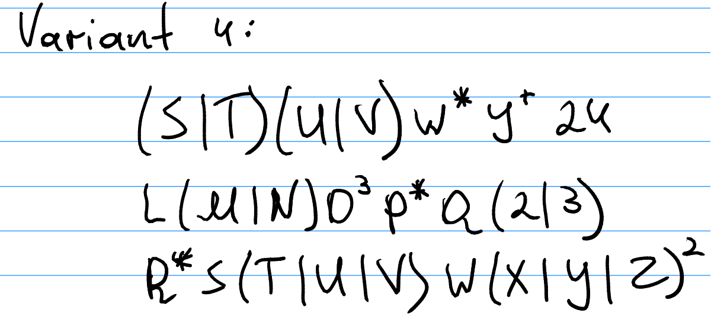
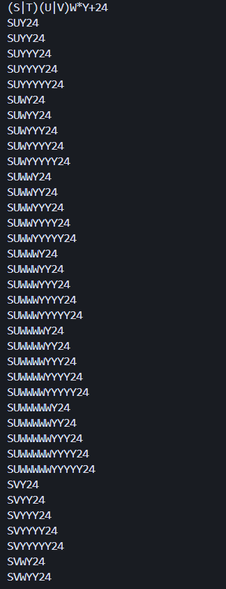
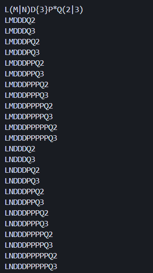
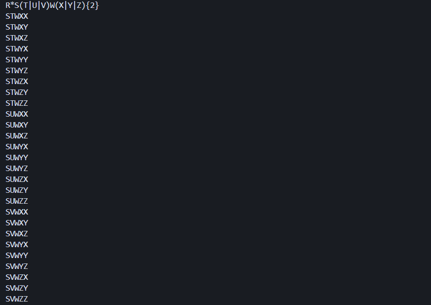

# Regular Expressions

### Course: Formal Languages & Finite Automata
### Author: Vladimir Vitcovschii

----

## Theory
Regular expressions (regex) are used in computing for pattern matching and text manipulation. They originated from formal language theory and enable identifying text strings that match specified patterns. Regex uses a set of characters to define these patterns, making it possible to perform complex search, validation, and text transformation operations efficiently.The syntax of regex includes literals, character classes, quantifiers, and position anchors to craft patterns for matching a wide range of strings. Despite their versatility, regex can be complex due to their concise syntax and variations across different programming environments. This complexity, however, is offset by their powerful capability to automate and streamline text processing tasks.
Regular expressions are a critical tool for programmers, data scientists, and system administrators, enhancing text data interaction and analysis. Mastery of regex opens up vast possibilities for text manipulation, making it a valuable skill in computer science.

## Objectives:
1. Write and cover what regular expressions are, what they are used for;
2. Below you will find 3 complex regular expressions per each variant. Take a variant depending on your number in the list of students and do the following:
    a. Write a code that will generate valid combinations of symbols conform given regular expressions (examples will be shown).
    b. In case you have an example, where symbol may be written undefined number of times, take a limit of 5 times (to evade generation of extremely long combinations);
    c. **Bonus point**: write a function that will show sequence of processing regular expression (like, what you do first, second and so on)

## Variant 


## Implementation Description
The `RegexMachine` class represents a tool designed to generate valid combinations of symbols that conform to given regular expressions. This class efficiently handles complex regex patterns by breaking them down into components and generating all possible valid combinations.

**Core Functionalities**
1) **Pattern Matching**: The `find_matching` method handles the parsing of nested structures like parentheses and curly braces, ensuring proper matching of opening and closing characters:

```python
def find_matching(self, start, open_char, close_char):
    depth = 0
    for i in range(start, len(self.pattern)):
        if self.pattern[i] == open_char:
            depth += 1
        elif self.pattern[i] == close_char:
            depth -= 1
            if depth == 0:
                return i
    raise ValueError(f"Unmatched {open_char}")
```

2) **Pattern Generation**: The `product` method efficiently generates all possible combinations from the parsed pattern components using a cartesian product approach:

```python
@staticmethod
def product(parts):
    if not parts:
        return []

    result = ['']
    for part in parts:
        temp = []
        for prefix in result:
            for item in part:
                temp.append(prefix + item)
        result = temp
    return result
```

3) **Pattern Parsing**: The `parse_pattern` method breaks down the regex pattern into its fundamental components, handling:
   - Groups with alternatives (A|B)
   - Exact repetitions {n}
   - Quantifiers (?, *, +)
   - Multi-digit literals
   - Single characters

The implementation includes a MAX_REPEAT constant (set to 5) to limit the number of repetitions for * and + quantifiers, preventing the generation of extremely long combinations.

## Results
The program successfully generates valid string combinations for complex regex patterns. For example, given the pattern 'R*S(T|U|V)W(X|Y|Z){2}', it generates all possible combinations where:
- R can appear 0 to 5 times (due to *)
- S appears exactly once
- Either T, U, or V appears once
- W appears exactly once
- Two characters from the set {X, Y, Z} appear at the end

The implementation efficiently handles:
- Alternation using parentheses (T|U|V)
- Fixed repetition using curly braces {2}
- Kleene star (*) for zero or more occurrences
- Complex combinations of these operators

Images:
    regex 1:

    
    
    regex 2:
    
    

    regex 3:
    
    


## Conclusion
The `RegexMachine` implementation demonstrates a robust approach to regex pattern generation, effectively handling various regex operators and their combinations. The modular design with separate methods for matching, parsing, and generation makes the code maintainable and extensible. The implementation successfully meets the laboratory objectives by providing a practical tool for understanding and working with regular expressions, while also maintaining reasonable limits on pattern generation to prevent computational explosion.
